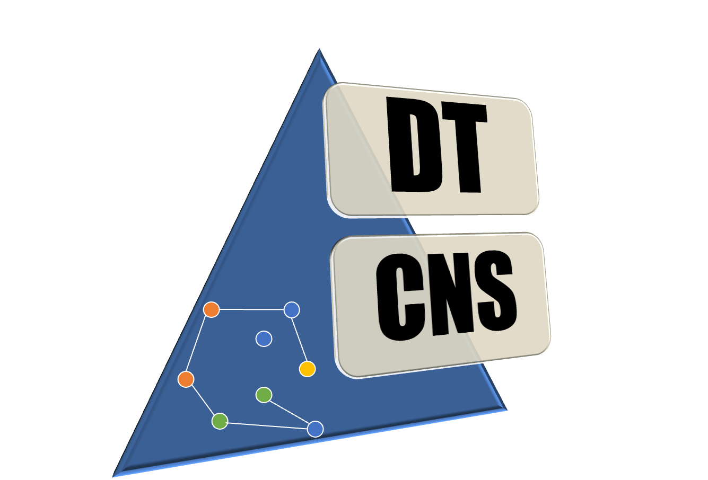
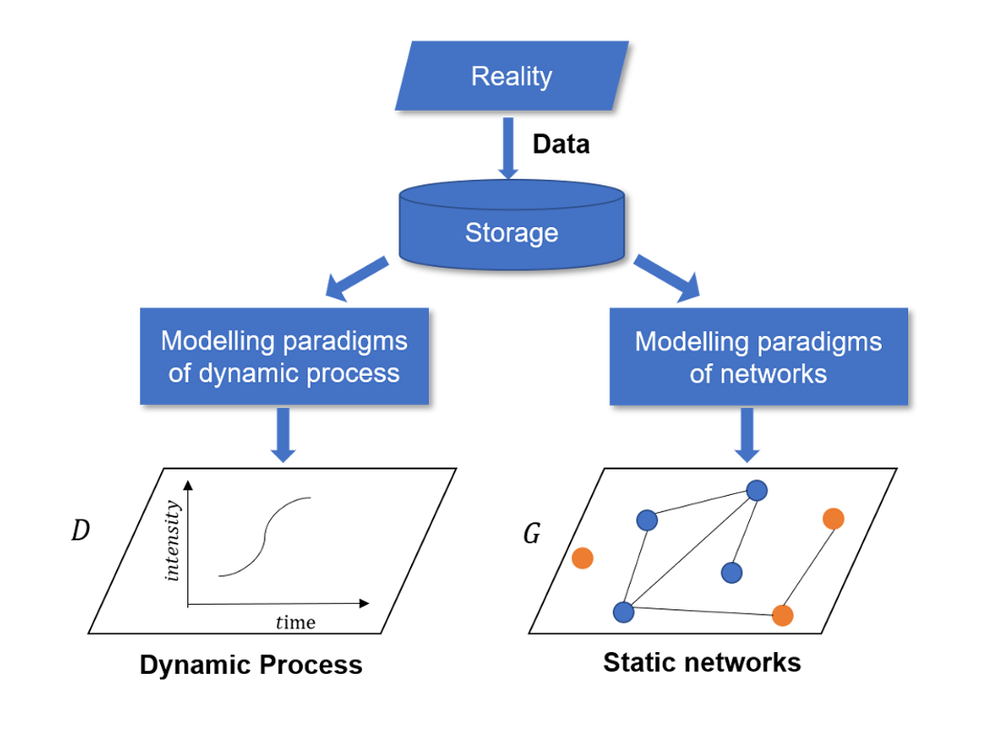
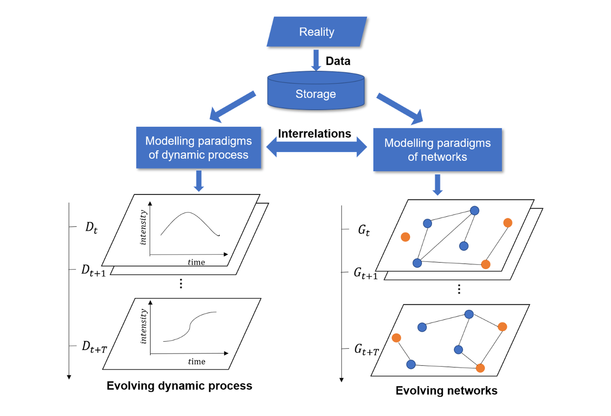

# An overview of the DTCNS package

The project was started in 2021 by Miss. Jiaqi Wen, [Prof. Bogdan Gabrys](https://profiles.uts.edu.au/Bogdan.Gabrys) and [Prof. Kaska Musial-Gabrys](https://profiles.uts.edu.au/katarzyna.musial-gabrys) at the Complex Adaptive Systems Lab - The University of Technology Sydney. This project is a core module for the simulation of Digital Twin-Oriented Complex Networked Systems in near future.

Digital Twin-Oriented Complex Networked Systems (DT-CNSs) is an approach proposed to deal with different levels of complexity when it comes to dynamics of and on the network with aim at faithfully representing and modelling real complex networked systems[1](#refer-anchor-1). In the space of social networks, the aim of the DT-CNS is to model interactions between people and dynamics of any processes propagating over the resulting from the interactions social network. The information that is utilised to build DT-CNS includes people's characteristics (e.g. age, gender) and preferences when it comes to who they want to interact with (i.e. preference of people towards specific age of others)[2](#refer-anchor-2).

The complexity of modelling DT-CNS dynamics comes from three primary elements: the modelling of networks, processes over networks, as well as the interrelation between the two. To have an overview of various DT-CNS resulting from those three elements, we introduce a 5-generation modelling framework to navigate a pathway through different levels of complexity of DT-CNSs [1](#refer-anchor-1)[2](#refer-anchor-2). The table below provides brief descriptions for each generation of DT-CNSs.

    
|Generation  |Brief Description|
|:----| :---- | 
|Generation 1 (G1) |Dynamic process on static networks|
|Generation 2a (G2a)|Evolving dynamic process on static networks|
|Generation 2b (G2b)|Dynamic process on evolving networks|
|Generation 3 (G3)|Evolving dynamic processes on evolving networks with interrelations between them|
|Generation 4 (G4)|Temporal dynamic processes on temporal networks with interrelations between them and the acquisition of real time information|
|Generation 5 (G5)|Temporal dynamic processes on temporal networks with interrelations between them, as well as the real time two-way feedback between the reality and the CNSs, enabling an idealised state required by a DT|

**Generation 1 (G1)** of DT-CNSs models dynamic process on static networks  (See the right figure). They simulate networks that are "frozen" in time, with a dynamic process taking place on the networks where parameters of this process do not change during the simulation (e.g. epidemic spreading process on static social networks with a fixed infection rate.)

**DTCNS** package can generate DT-CNSs in **G1** by simulating static networks and dynamic processes on these networks. The static networks are simulated based on the heterogeneous features of nodes, fuzzy representation of uncertain features and the interaction rules that characterise the nodes' preference for connecting with others. This package also enables the spreading simulations on static networks, which start from a seed node and spread to other nodes based on transmission rules that determines the nodes' liability to the spread.

Please see the documents for [DT-CNSs in **G1**](./G1documents.ipynb)

**Gerneration 2 (G2)** of DT-CNSs has two vairations. **Generation 2a (G2a)** focus on evolving dynamic process on static networks (See the lower left figure). They simulate a static network where a dynamic process changes its parameters over time and gets captured in snapshots (e.g. epidemic spreading processes on static social networks with a changeable infection rate). **Generation 2b (G2b)** focuses on the dynamic process of evolving networks (See the lower right figure). They simulate network snapshots that describe the network topology changes over time, where the dynamic process takes place without changing its parameters (e.g. epidemic spreading process with a non-changeable infection rate on the social network that evolves over time).

**DTCNS** package can generate DT-CNSs in **G2** by simulating the independent changes of networks and dynamic processes. This package enables the simulation of dynamic networks by changing nodes' features and nodes' preferences for connecting with others. It can also simulate evolving processes by changing transmissibility over time.

Please see the documents for [DT-CNSs in **G2**](./G2documents.ipynb)

**Generation 3 (G3)** of DT-CNSs focuses on evolving dynamic processes on evolving networks with interrelations between them (See the left figure). They simulate networks, dynamic processes and their changes using a snapshot approach (data are processed in batches), while incorporating the interactions between a network and a process. For example, nodes in social networks change social preferences to avoid infection risk in an epidemic outbreak. Meanwhile, epidemics' transmissibility varies from people and decays over time.

**Please note that this package is under active development and the G3 functionalities will soon be public.**

**Generation 4 (G4)** of DT-CNSs focus ones temporal dynamic processes on temporal networks with interrelations between them and the continuous acquisition of real time information (see the lower left figure). They simulate networks and the dynamic processes with instantaneous changes of network topology and parameters, while incorporating the interactions between a process and a network.

**Generation 5 (G5)** further extend the DT-CNSs in G4 by closing the feedback loop between the DT-CNSs and the real system and can be identified as an idealised state that can be named as a Digital Twin (DT). In **G5**, the temporal dynamic processes occur on temporal networks with interrelations and the real-time acquisition and feedback of information between the DT and reality (See the lower right figure). More specifically, compared with **G4**, **G5** is equipped with another real-time information flow from the reality to the model. This enables the two-way real-time information feedback between the DT and reality.

**Please note that this package is under active development and the G3 and G4 functionalities will soon be public.**

## References

- [1] Wen, Jiaqi, Bogdan Gabrys, and Katarzyna Musial. "Towards digital twin oriented modelling of complex networked systems and their dynamics: a comprehensive survey." IEEE Access (2022).

- [2] Wen, Jiaqi, Bogdan Gabrys, and Katarzyna Musial. "Review and Assessment of Digital Twin--Oriented Social Network Simulators." arXiv preprint arXiv:2305.03234 (2023).
